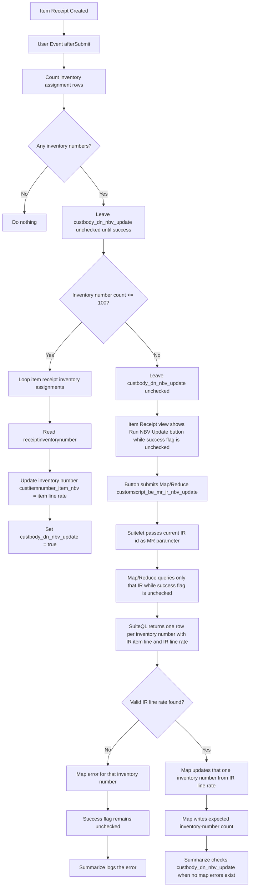
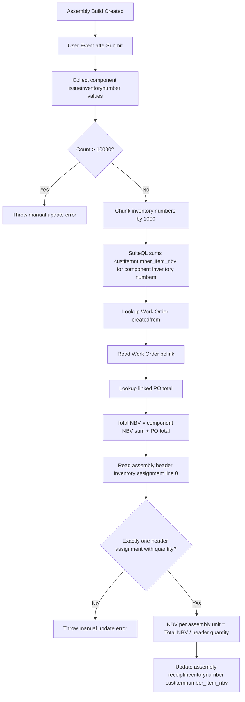

# TK11594 NBV Update Flow

## Item Receipt NBV Update

## Manual Button Behavior

The Item Receipt button appears in view mode when `custbody_dn_nbv_update` is not checked. It is intended for Item Receipts with many inventory numbers where the afterSubmit flow leaves the record for Map/Reduce processing.

Button target through the proxy admin Suitelet:

- Script: `customscript_be_mr_ir_nbv_update`
- Deployment: `customdeploy_be_mr_ir_nbv_update`
- Parameter: `custscript_be_ir_nbv_update_ir_id`

## Item Receipt Rate Fallback

Current Map/Reduce behavior uses the Item Receipt transaction line `rate` as the NBV value:

- Source field: `transactionline.rate`
- Output field: `inventorynumber.custitemnumber_item_nbv`

There is no fallback NBV value when the Item Receipt line rate is missing or invalid. The Map/Reduce intentionally fails that inventory number map row instead of writing `0`, a blank value, using a PO line rate, or any other guessed amount.

Current fail-fast behavior:

- `getInputData` requires `custscript_be_ir_nbv_update_ir_id` and returns a SuiteQL input filtered to that one Item Receipt.
- SuiteQL returns one row per inventory number with the Item Receipt item line, Item Receipt line rate, and expected inventory-number row count for that IR.
- Each map invocation handles one inventory number only.
- If an inventory number ID is missing, that map row throws an error.
- If `transactionline.rate` is missing or not numeric, that map row throws an error.
- If the row is valid, map calls `record.submitFields` once for that inventory number and writes the expected inventory-number count.
- Summarize checks `custbody_dn_nbv_update` only when there are no input/map errors and the success count matches the expected inventory-number row count for the passed Item Receipt.
- If any inventory number row fails for an Item Receipt, `custbody_dn_nbv_update` remains unchecked for that Item Receipt.
- The Item Receipt can be corrected and processed again later by the button/Map/Reduce.

The Map/Reduce does include a fallback for line matching, not for rate value:

- First it tries to match `inventoryassignment.transactionline` to `transactionline.id`.
- Then it tries `inventoryassignment.transactionline` to `transactionline.linesequencenumber`.
- If no direct line key match exists, and there is only one non-mainline transaction line for that item on the Item Receipt, it falls back to that single item line.

This fallback only helps identify the correct Item Receipt line. Once the line is found, the line still must have a valid numeric `rate`.

## Assembly Build NBV Update

## Key Assumptions

- Item Receipt small batches update immediately when the total inventory assignment count is `<= 100`, then check `custbody_dn_nbv_update` only after success.
- Item Receipt large batches stay unchecked and are handled by the Map/Reduce.
- Assembly Build components are summed by inventory number NBV value, then the linked PO total is added.
- Assembly Build header inventory detail has exactly one assignment row: either one serial with quantity `1`, or one lot with quantity `N`.
- Assembly Build output NBV is calculated as `(component inventory number NBV sum + PO total) / assembly header quantity`.
